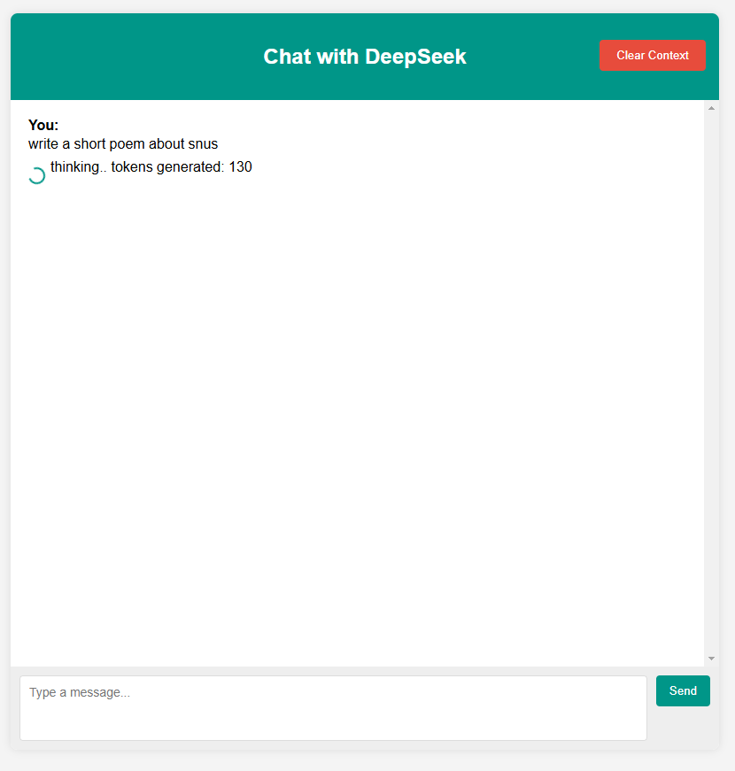
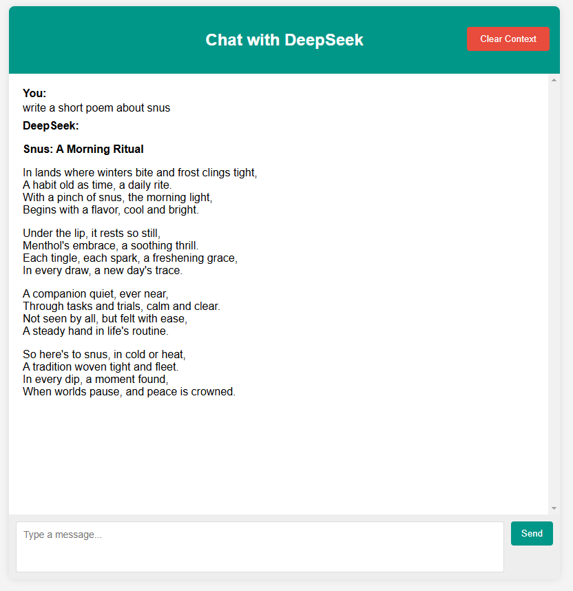
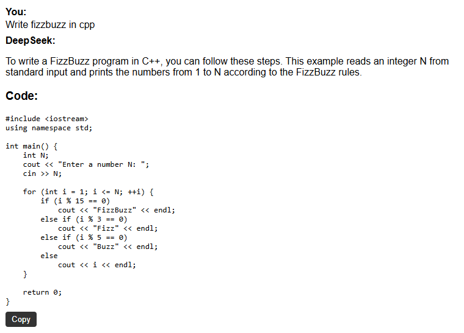

**Basic web ui for chatting with deepseek**

**Preview**





**What it can do**

- automatically remove the \<think>...\</think> part of deepseek in the ui part, replacing it with "thinking", displaying the amout of tokens within thinking block.

- clear context with the "clear context" btn

- copy code



***HOW TO RUN***
*You must have ollama installed with deepseek, here is the link to ollama installation:*
- https://ollama.com/download
- https://ollama.com/library/deepseek-r1:14b

I'm running the 14b param version. You can run whatever version runs well on your setup. If you want to run a different version, make sure to change MODEL_TYPE in main.py. Before running this webui make sure to go to http://localhost:11434/ and check that ollama is running. Ollama API docs - https://github.com/ollama/ollama/blob/main/docs/api.md

Running this webui is pretty straightforward, you need to have python installed with
- flask
- flask_cors

```
pip install flask flask_cors
```

Then run 

```
python main.py
```

Then this webui should appear on http://localhost:3000/